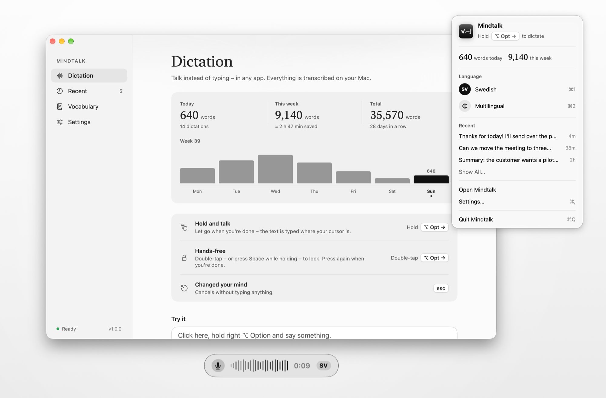
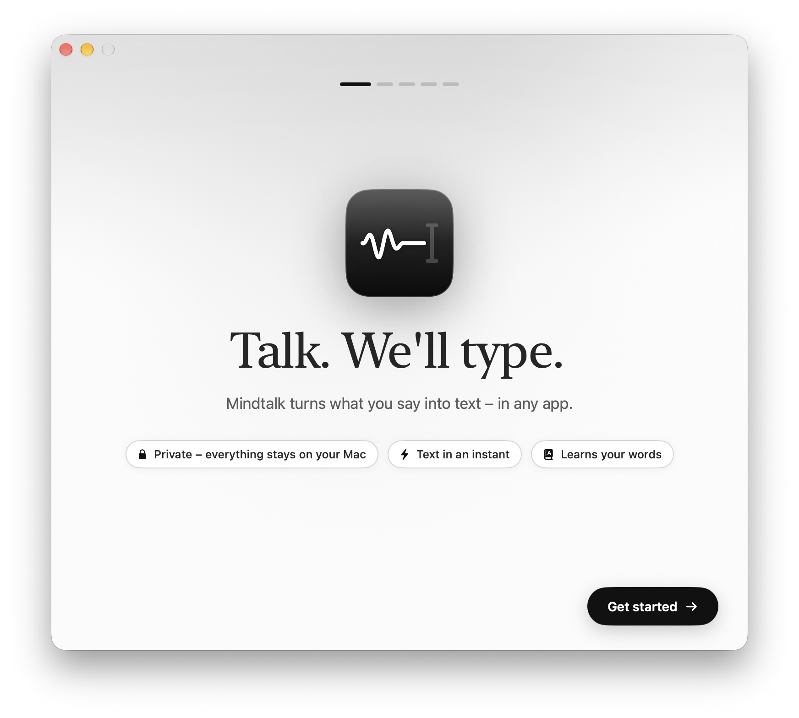
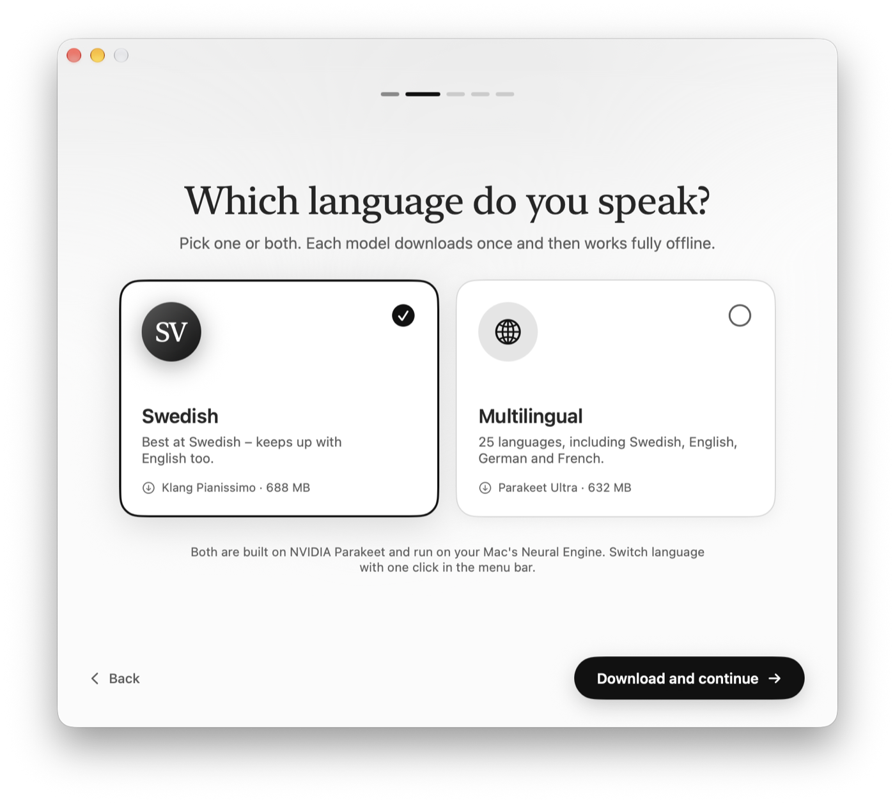
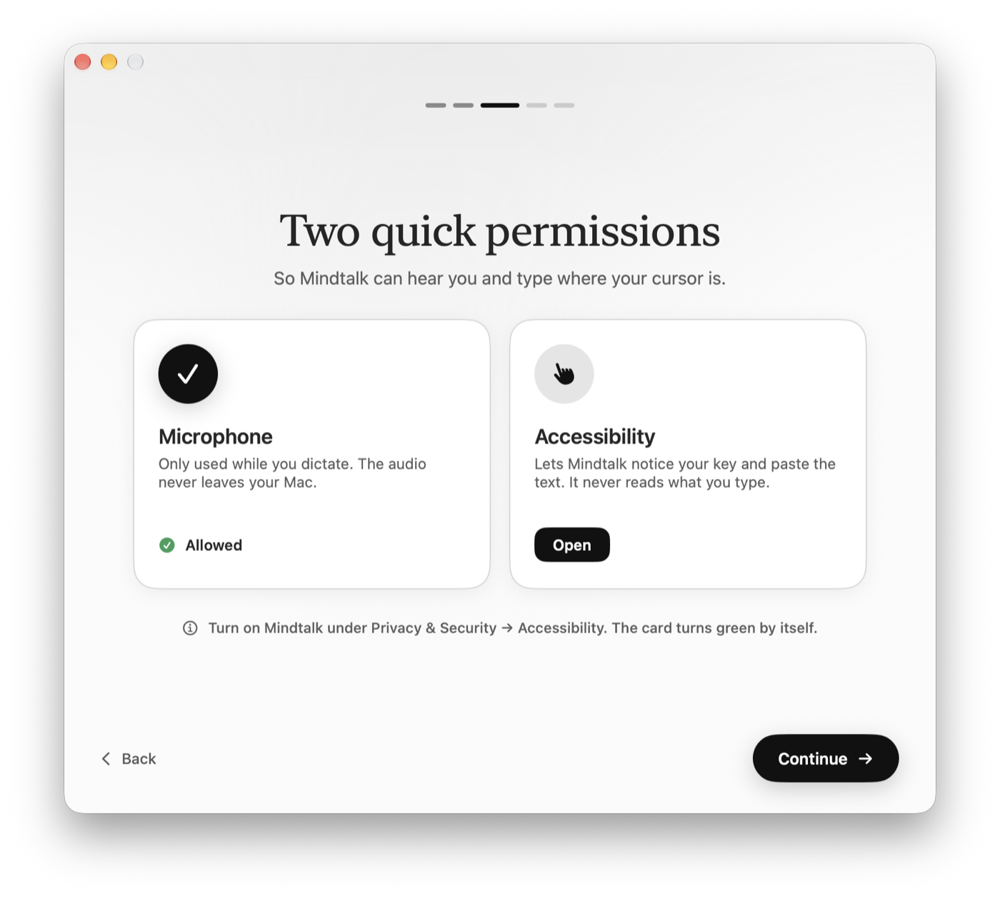
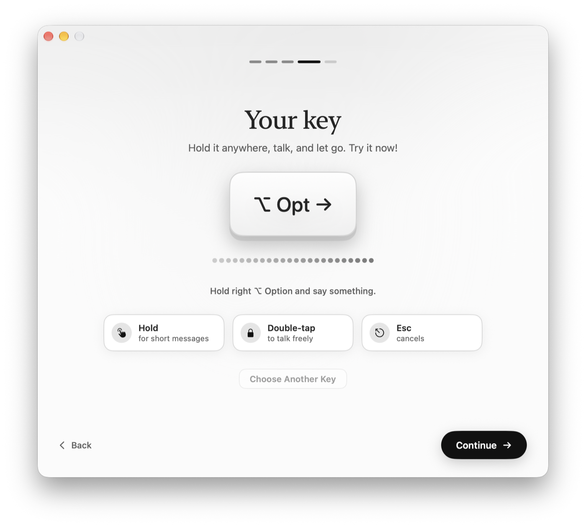
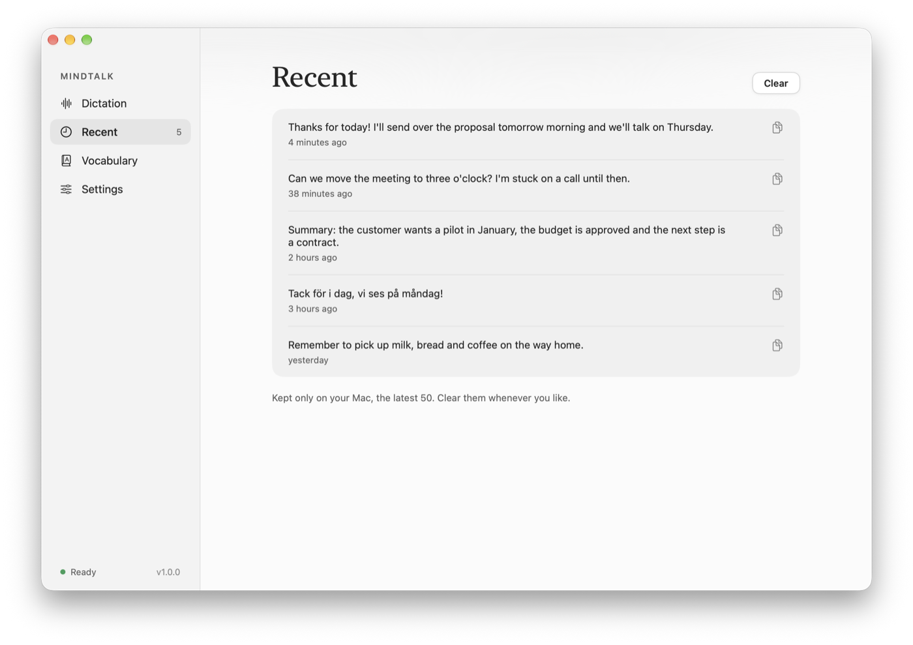
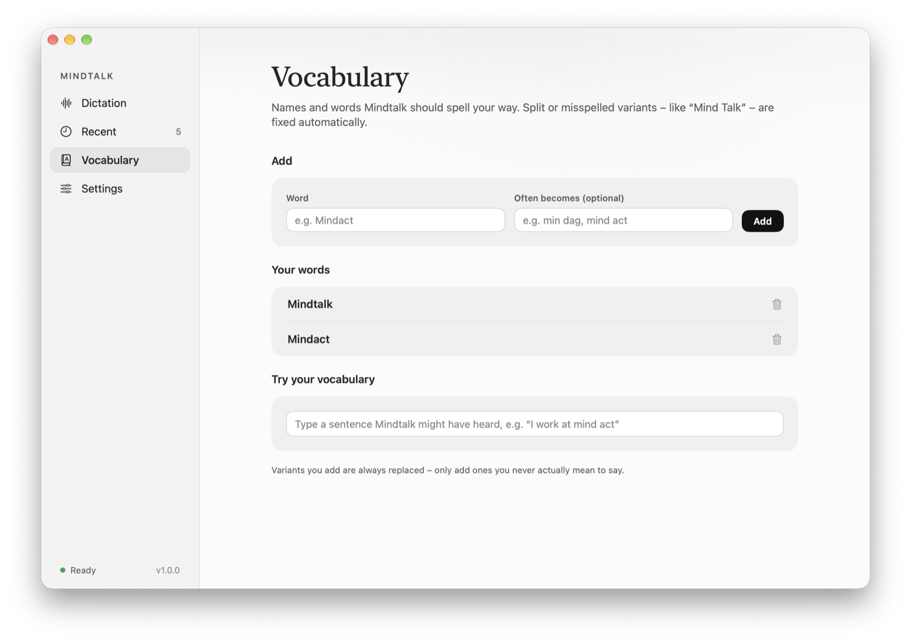
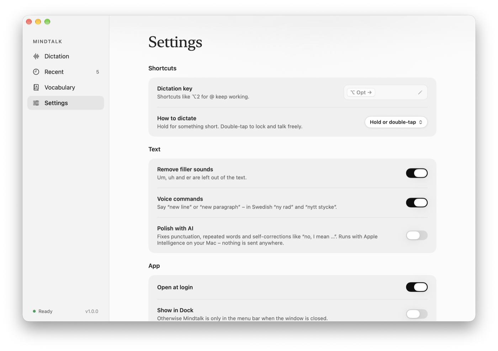
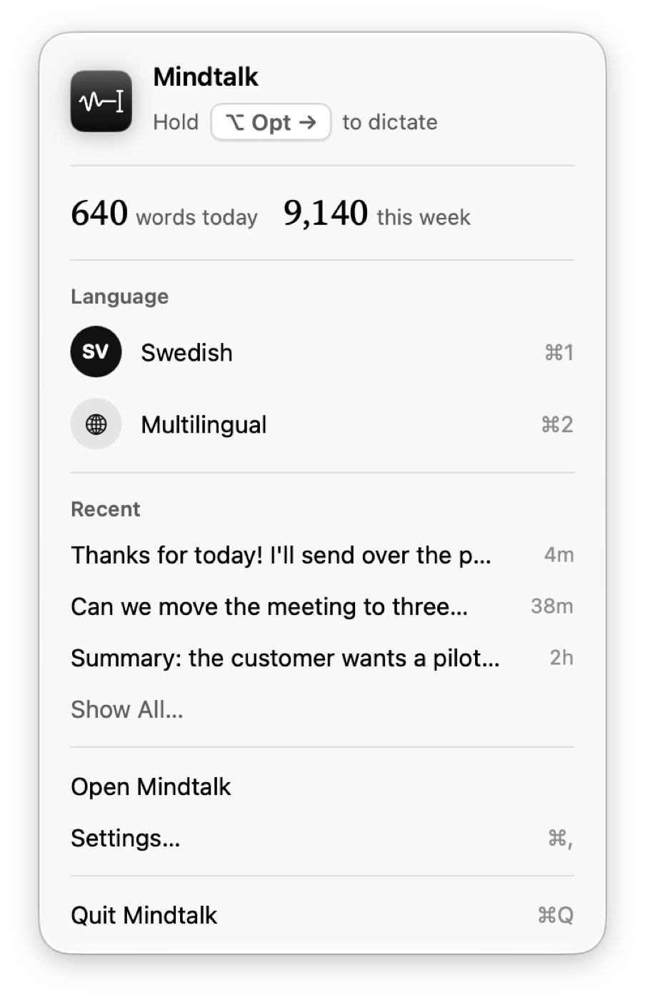
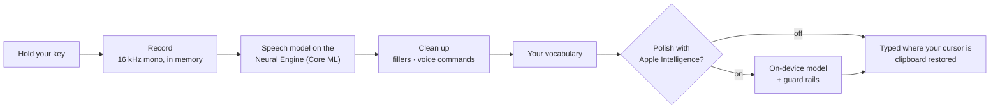

<p align="center">
  
</p>

<h1 align="center">Mindtalk</h1>

<p align="center">
  <b>Talk. We'll type.</b><br>
  Private, on-device dictation for the Mac. Hold a key, speak, let go —<br>
  your words appear wherever your cursor is. Superb Swedish, 25 languages in all.
</p>

<p align="center">
  <a href="https://github.com/dragon6sic6/Mindtalk/releases/latest/download/Mindtalk.dmg"></a>
</p>

<p align="center">
  
  
  
  
  <a href="LICENSE"></a>
</p>

<p align="center"><a href="README.sv.md">Läs på svenska</a></p>

<picture>
  <source media="(prefers-color-scheme: dark)" srcset="docs/images/en/hero-dark.png">
  
</picture>

## Why Mindtalk

- **Everything stays on your Mac.** Speech is recognised on the Neural Engine. The audio lives in memory and is gone the moment your text is typed. No account, no cloud, no analytics.
- **Swedish that actually sounds like Swedish.** Pick *Klang Pianissimo*, a Swedish speech model, or *Parakeet Ultra* for 25 languages — and switch with one click.
- **Works in every app.** Mail, Slack, Notes, your code editor, a browser field — if it has a text cursor, Mindtalk can type into it.
- **Fast.** A five-second sentence is transcribed in about a third of a second on Apple Silicon.
- **Made to feel native.** Liquid Glass, light and dark mode, Swedish and English interface, and a menu bar panel that behaves like the system's own.

## Features

| | |
|---|---|
| **Your key, your way** | Hold any key to talk (right ⌥ Option by default). Double-tap — or press Space while holding — to lock hands-free. <kbd>Esc</kbd> cancels. Prefer tap-to-start? That's a setting. |
| **Two speech models** | Swedish (Klang Pianissimo) or multilingual (Parakeet Ultra). Download one or both during setup; switch with <kbd>⌘1</kbd> / <kbd>⌘2</kbd> in the menu bar. |
| **Text that's ready to send** | Filler sounds (*eh, öh, um*) disappear. Say *"new line"* or *"new paragraph"* for line breaks. |
| **Polish with Apple Intelligence** *(optional)* | Fixes punctuation, accidental repeats and self-corrections (*"Tuesday — no, I mean Wednesday"* → *"Wednesday"*), on-device. Guard-railed so it can only remove words, never add, answer or rephrase. |
| **Vocabulary** | Teach it names and terms. Split or misheard variants (*"Mind Talk"*) are corrected automatically — ordinary words and text in capitals are left alone. Edit, undo, search. |
| **Music pauses while you talk** | Spotify, Music and browser video pause while you dictate and resume afterwards. Anything else (a call, a game) fades down instead. |
| **Recent dictations** | The last 50, kept on your Mac, one click to copy. Landed in the wrong place? Put the cursor right and press <kbd>⌃⌥V</kbd> to paste it again. |
| **Stays up to date** | Checks for new versions once a day and updates itself — every update signed with Mindtalk's own key and notarized by Apple. |
| **Statistics** | Words per day, time saved versus typing, your streak. Numbers only; never the text. |
| **Microphone picker** | Built-in mic by default (Bluetooth headsets lose quality when their mic opens), or any input — with a live level meter to check it hears you. |

## A tour

### First launch

A five-step introduction gets you from download to your first dictation in about a minute: choose your language model, grant two permissions, pick your key, and try it for real.

<table>
  <tr>
    <td width="50%"><picture><source media="(prefers-color-scheme: dark)" srcset="docs/images/en/onboarding-welcome-dark.png"></picture></td>
    <td width="50%"><picture><source media="(prefers-color-scheme: dark)" srcset="docs/images/en/onboarding-language-dark.png"></picture></td>
  </tr>
  <tr>
    <td align="center"><sub><b>Welcome</b></sub></td>
    <td align="center"><sub><b>Choose Swedish, multilingual or both</b></sub></td>
  </tr>
  <tr>
    <td width="50%"><picture><source media="(prefers-color-scheme: dark)" srcset="docs/images/en/onboarding-permissions-dark.png"></picture></td>
    <td width="50%"><picture><source media="(prefers-color-scheme: dark)" srcset="docs/images/en/onboarding-key-dark.png"></picture></td>
  </tr>
  <tr>
    <td align="center"><sub><b>Two permissions, explained</b></sub></td>
    <td align="center"><sub><b>Pick your key — the meter shows it hears you</b></sub></td>
  </tr>
</table>

### The app

<table>
  <tr>
    <td width="50%"><picture><source media="(prefers-color-scheme: dark)" srcset="docs/images/en/recent-dark.png"></picture></td>
    <td width="50%"><picture><source media="(prefers-color-scheme: dark)" srcset="docs/images/en/vocabulary-dark.png"></picture></td>
  </tr>
  <tr>
    <td align="center"><sub><b>Recent — click to copy</b></sub></td>
    <td align="center"><sub><b>Vocabulary — names spelled your way</b></sub></td>
  </tr>
  <tr>
    <td width="50%"><picture><source media="(prefers-color-scheme: dark)" srcset="docs/images/en/settings-dark.png"></picture></td>
    <td width="50%" align="center"><picture><source media="(prefers-color-scheme: dark)" srcset="docs/images/en/panel-dark.png"></picture></td>
  </tr>
  <tr>
    <td align="center"><sub><b>Settings</b></sub></td>
    <td align="center"><sub><b>The menu bar panel</b></sub></td>
  </tr>
</table>

## How it works



1. A **global key listener** (a Core Graphics event tap) notices your key, even while other apps are in front.
2. **AVAudioEngine** records 16 kHz mono from the microphone you chose — only while you hold the key.
3. **[FluidAudio](https://github.com/FluidInference/FluidAudio)** runs the Parakeet TDT speech model on the **Neural Engine** through Core ML.
4. **Rules** remove filler sounds and turn *"new line"* into line breaks — but not in *"add a new line to the table"*.
5. Your **vocabulary** fixes names and terms.
6. *Optional:* **Apple's on-device language model** (Foundation Models framework) polishes punctuation and self-corrections, line by line. Its answer is accepted only if it keeps the original's letters in order and just removes some — so it can never add words, answer a question in your text or rephrase you. Anything else, or a slow reply, and the rule-cleaned text is used.
7. The text is **pasted** where your cursor is and your clipboard is put back as it was. No text field there (the desktop, a web page)? It goes to the clipboard instead, and the indicator says so. Or turn on *Keep text in clipboard* to always have it ready for <kbd>⌘V</kbd>.

## Speech models

Neither model ships inside the app. You choose during setup; each downloads once from a pinned revision on Hugging Face, every file is checked against its SHA-256, and from then on everything works offline.

| | Model | By | Languages | Size |
|---|---|---|---|---|
| **Swedish** | [Klang Pianissimo](https://huggingface.co/KlangAI/pianissimo-sv) | Klang AI AB | Swedish, and it keeps up with English | 688 MB |
| **Multilingual** | [Parakeet Ultra](https://huggingface.co/moondream/parakeet-ultra) | Moondream | 25 European languages | 632 MB |

Both are fine-tuned from [NVIDIA Parakeet TDT 0.6B v3](https://huggingface.co/nvidia/parakeet-tdt-0.6b-v3) and licensed [CC BY 4.0](https://creativecommons.org/licenses/by/4.0/). Core ML conversions by [markstrom](https://huggingface.co/markstrom/pianissimo-sv-coreml) and [FluidInference](https://huggingface.co/FluidInference/parakeet-ultra-coreml).

## Privacy

- **No network**, except downloading a speech model you asked for and checking for updates.
- **Audio is never written to disk** — it's transcribed from memory and discarded.
- **Recent dictations** (the last 50) are stored in `~/Library/Application Support/Mindtalk`, readable only by your user account, and can be cleared at any time.
- **Password fields:** text dictated into one is typed but never kept — not in Recent, not in the statistics.
- **Statistics** count words and seconds per day — never the text itself.
- **Accessibility** is used to notice your key and to paste.
- **The AI polish is guard-railed:** its answer is used only if it merely removes fillers, repeats or what a self-correction replaces — it can never add words, drop a "not", or answer your text.

## Install

1. [Download Mindtalk](https://github.com/dragon6sic6/Mindtalk/releases/latest/download/Mindtalk.dmg) — signed with Developer ID and notarized by Apple.
2. Open the DMG and drag **Mindtalk** to **Applications**.
3. Open Mindtalk. The introduction walks you through the rest. (Opened it straight from the DMG or Downloads? Mindtalk offers to move itself into Applications.)

From then on Mindtalk keeps itself up to date — see what's new under [Releases](https://github.com/dragon6sic6/Mindtalk/releases).

<p align="center"></p>

**Requirements:** a Mac with Apple Silicon (M1 or later), macOS 26 Tahoe or later, and about 700 MB free per speech model. *Polish with AI* needs Apple Intelligence to be turned on.

## Keyboard

| | |
|---|---|
| Hold your key | Talk; let go to type |
| Double-tap your key | Lock hands-free; tap again to finish |
| <kbd>Space</kbd> while holding | Lock hands-free |
| <kbd>Esc</kbd> | Cancel without typing anything |
| <kbd>⌘1</kbd> / <kbd>⌘2</kbd> | Swedish / multilingual (in the menu bar panel) |
| <kbd>⌃⌥V</kbd> | Paste the last dictation again |
| <kbd>⌘,</kbd> | Settings |

## Build from source

```bash
brew install xcodegen
git clone https://github.com/dragon6sic6/Mindtalk.git && cd Mindtalk
make run        # Debug build, then launch
```

More in [docs/DEVELOPMENT.md](docs/DEVELOPMENT.md): self-tests without a microphone, the release pipeline, regenerating these screenshots, and a map of the source.

## Built with

- **Swift, SwiftUI and AppKit** — a menu bar app with Liquid Glass on macOS 26
- **[FluidAudio](https://github.com/FluidInference/FluidAudio)** — Parakeet TDT inference on the Neural Engine via Core ML
- **Foundation Models** — Apple's on-device language model, for the optional polish
- **Core Audio** — microphone selection, device changes, and knowing which apps are playing sound
- **AVAudioEngine** — 16 kHz capture from any input device
- **Core Graphics event taps** — the global push-to-talk key
- **ServiceManagement** — open at login
- **[Sparkle](https://sparkle-project.org)** — signed automatic updates
- **String Catalogs** — Swedish and English interface
- **Icon Composer** — a layered Liquid Glass app icon
- **XcodeGen** and **dmgbuild** — reproducible project and a laid-out DMG

## Credits

Mindtalk is made by [Mindact Solutions AB](https://mindact.ai) in Sweden.

Speech recognition by **Klang Pianissimo** (Klang AI AB) and **Parakeet Ultra** (Moondream), both built on **NVIDIA Parakeet TDT 0.6B v3** — CC BY 4.0. Inference by **FluidAudio** (FluidInference, Apache 2.0). Full credits and links are in the app under *Settings → About Mindtalk*.

## License

Mindtalk's source code is released under the [MIT License](LICENSE). The speech models are not part of this repository and keep their own licenses (CC BY 4.0).
