<p align="center">
  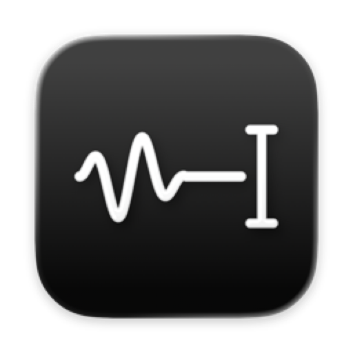
</p>

<h1 align="center">Mindtalk</h1>

<p align="center">
  <b>Prata. Vi skriver.</b><br>
  Diktering för Mac som stannar på din dator. Håll in en tangent, prata, släpp –<br>
  texten hamnar där markören står. Riktigt bra svenska, 25 språk totalt.
</p>

<p align="center">
  <a href="https://github.com/dragon6sic6/Mindtalk/releases/latest/download/Mindtalk.dmg"></a>
</p>

<p align="center">
  
  
  
  <a href="LICENSE"></a>
</p>

<p align="center"><a href="README.md">Read in English</a></p>

<picture>
  <source media="(prefers-color-scheme: dark)" srcset="docs/images/sv/hero-dark.png">
  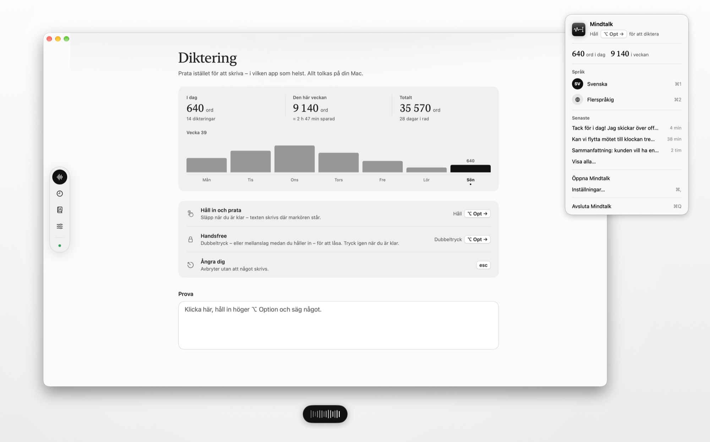
</picture>

## Därför Mindtalk

- **Allt stannar på din Mac.** Talet tolkas på Neural Engine. Ljudet finns bara i minnet och försvinner så fort texten är inskriven. Inget konto, inget moln, ingen spårning.
- **Svenska som låter som svenska.** Välj *Klang Pianissimo*, en svensk talmodell, eller *Parakeet Ultra* för 25 språk – och byt med ett klick.
- **Fungerar i alla appar.** Mail, Slack, Anteckningar, kodeditorn, ett fält i webbläsaren – har den en textmarkör kan Mindtalk skriva där.
- **Snabb.** En mening på fem sekunder tolkas på ungefär en tredjedels sekund på Apple Silicon.
- **Känns som en del av macOS.** Liquid Glass, ljust och mörkt läge, svenskt och engelskt gränssnitt, och en menyradspanel som beter sig som systemets egna.

## Funktioner

| | |
|---|---|
| **Din tangent, ditt sätt** | Håll in valfri tangent och prata (höger ⌥ Option som standard). Dubbeltryck – eller mellanslag medan du håller in – för att låsa handsfree. <kbd>Esc</kbd> avbryter. Vill du hellre trycka för att starta? Det är en inställning. |
| **Två talmodeller** | Svenska (Klang Pianissimo) eller flerspråkig (Parakeet Ultra). Ladda ned en eller båda i introduktionen; byt med <kbd>⌘1</kbd> / <kbd>⌘2</kbd> i menyraden. |
| **Text som är klar att skicka** | Tvekljud (*eh, öh, um*) försvinner. Säg *”ny rad”* eller *”nytt stycke”* för radbrytningar. |
| **Putsa med Apple Intelligence** *(valfritt)* | Rättar skiljetecken, upprepningar och självrättelser (*”tisdag, nej jag menar onsdag”* → *”onsdag”*) på datorn. Med skyddsspärrar: den kan bara ta bort ord, aldrig lägga till, svara eller formulera om. |
| **Ordlista** | Lär den namn och begrepp. Delade eller felhörda varianter (*”Mind Talk”*) rättas automatiskt – vanliga ord och text i versaler lämnas orörda. Ändra, ångra, sök. |
| **Musiken pausas medan du pratar** | Spotify, Musik och video i webbläsaren pausas under dikteringen och fortsätter efteråt. Annat ljud (ett samtal, ett spel) tonas ner i stället. |
| **Senaste dikteringar** | De senaste 50, sparade på din Mac, ett klick för att kopiera. Hamnade texten fel? Ställ markören rätt och tryck <kbd>⌃⌥V</kbd>. |
| **Håller sig uppdaterad** | Söker efter nya versioner en gång om dagen och uppdaterar sig själv – varje uppdatering signerad med Mindtalks egen nyckel och notariserad av Apple. |
| **Statistik** | Ord per dag, sparad tid jämfört med att skriva, dagar i rad. Bara siffror, aldrig texten. |
| **Mikrofonval** | Inbyggd mikrofon som standard (Bluetooth-headset tappar kvalitet när deras mikrofon öppnas) eller valfri enhet – med levande nivåmätare. |

## En rundtur

### Första starten

En introduktion i fem steg tar dig från nedladdning till första dikteringen på ungefär en minut: välj språkmodell, ge två behörigheter, välj tangent och prova på riktigt.

<table>
  <tr>
    <td width="50%"><picture><source media="(prefers-color-scheme: dark)" srcset="docs/images/sv/onboarding-welcome-dark.png">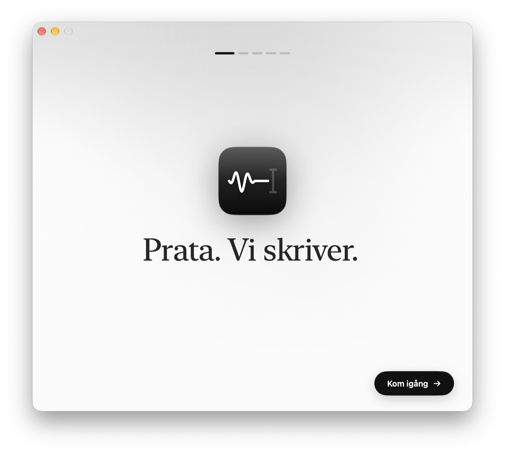</picture></td>
    <td width="50%"><picture><source media="(prefers-color-scheme: dark)" srcset="docs/images/sv/onboarding-language-dark.png">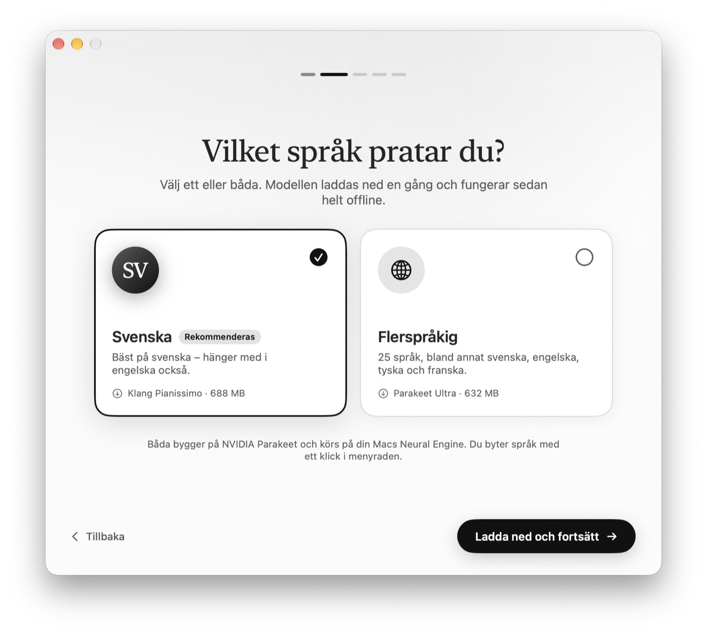</picture></td>
  </tr>
  <tr>
    <td align="center"><sub><b>Välkommen</b></sub></td>
    <td align="center"><sub><b>Svenska, flerspråkig eller båda</b></sub></td>
  </tr>
  <tr>
    <td width="50%"><picture><source media="(prefers-color-scheme: dark)" srcset="docs/images/sv/onboarding-permissions-dark.png">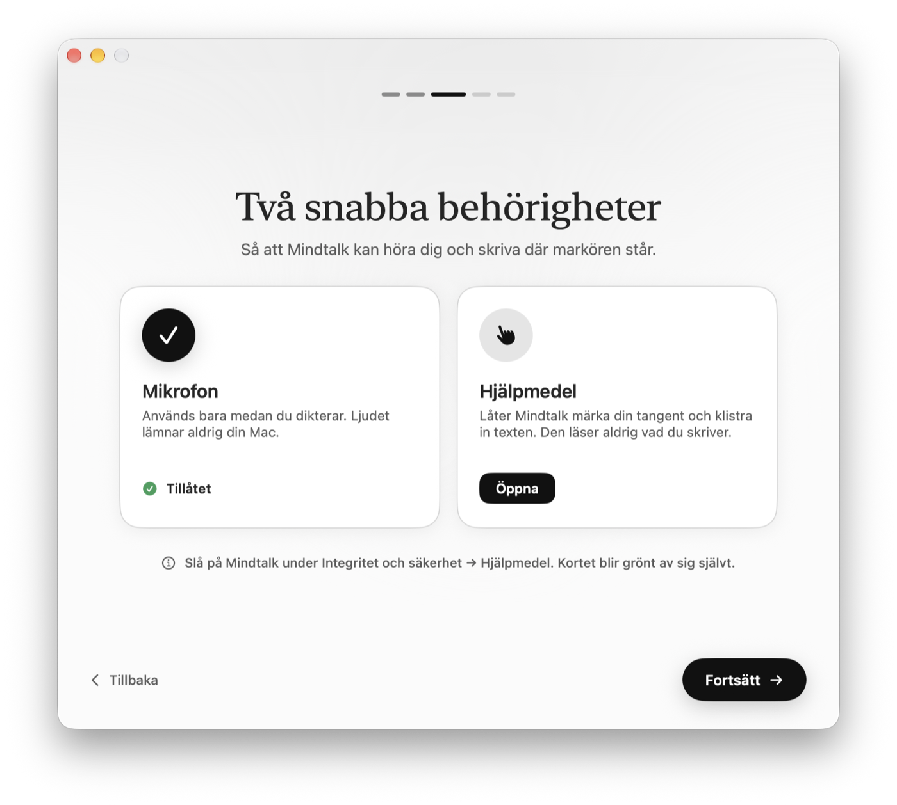</picture></td>
    <td width="50%"><picture><source media="(prefers-color-scheme: dark)" srcset="docs/images/sv/onboarding-key-dark.png">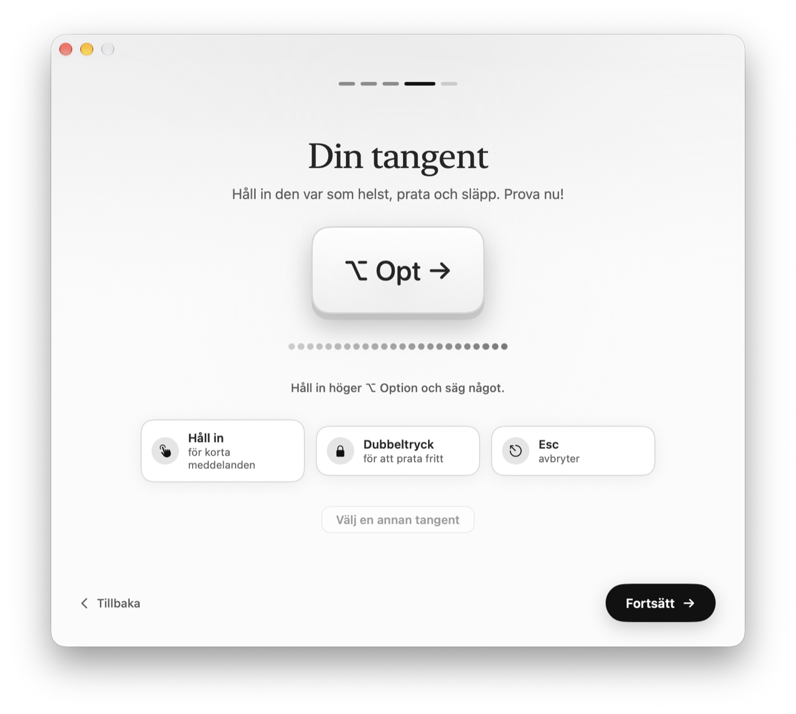</picture></td>
  </tr>
  <tr>
    <td align="center"><sub><b>Två behörigheter, förklarade</b></sub></td>
    <td align="center"><sub><b>Välj tangent – mätaren visar att den hör dig</b></sub></td>
  </tr>
</table>

### Appen

<table>
  <tr>
    <td width="50%"><picture><source media="(prefers-color-scheme: dark)" srcset="docs/images/sv/recent-dark.png">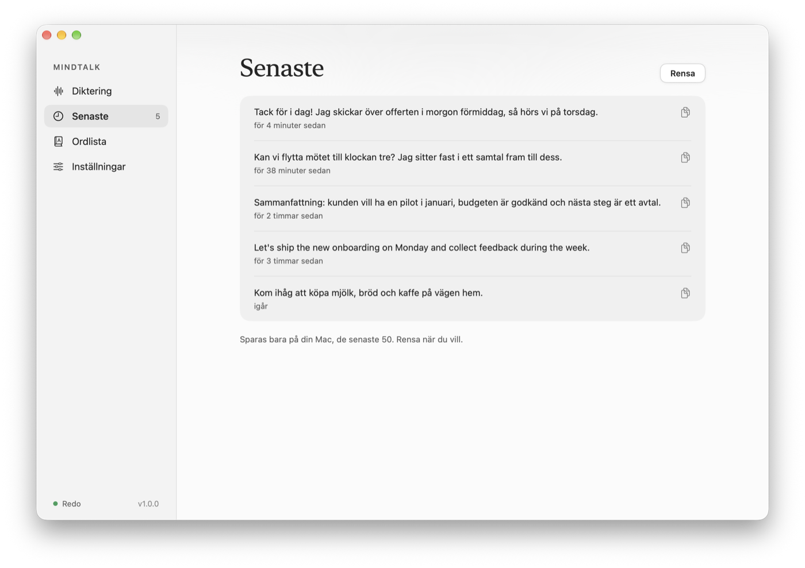</picture></td>
    <td width="50%"><picture><source media="(prefers-color-scheme: dark)" srcset="docs/images/sv/vocabulary-dark.png">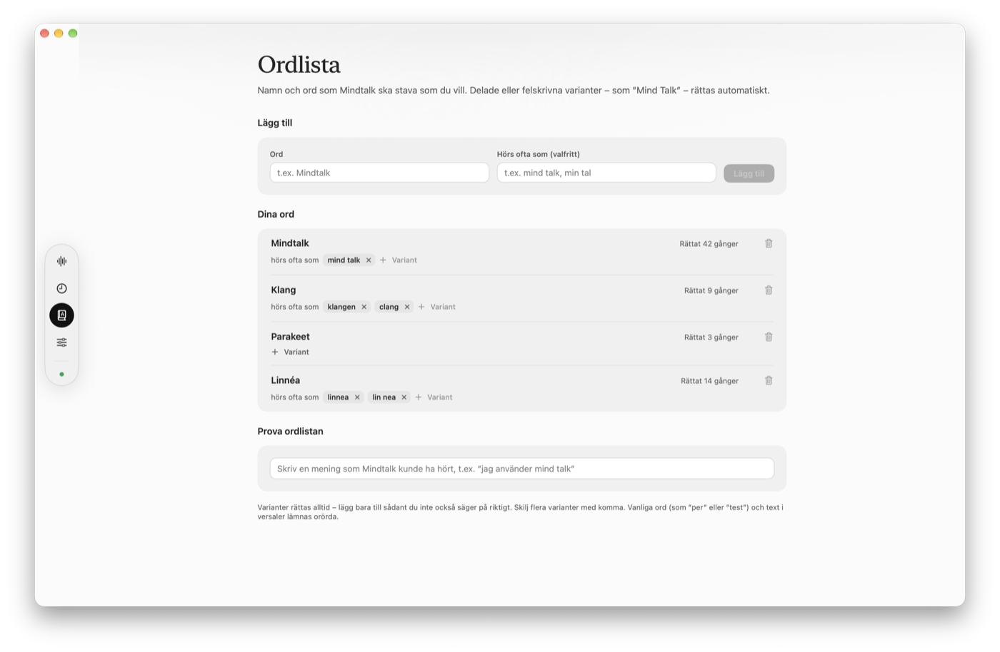</picture></td>
  </tr>
  <tr>
    <td align="center"><sub><b>Senaste – klicka för att kopiera</b></sub></td>
    <td align="center"><sub><b>Ordlista – namn stavade som du vill</b></sub></td>
  </tr>
  <tr>
    <td width="50%"><picture><source media="(prefers-color-scheme: dark)" srcset="docs/images/sv/settings-dark.png">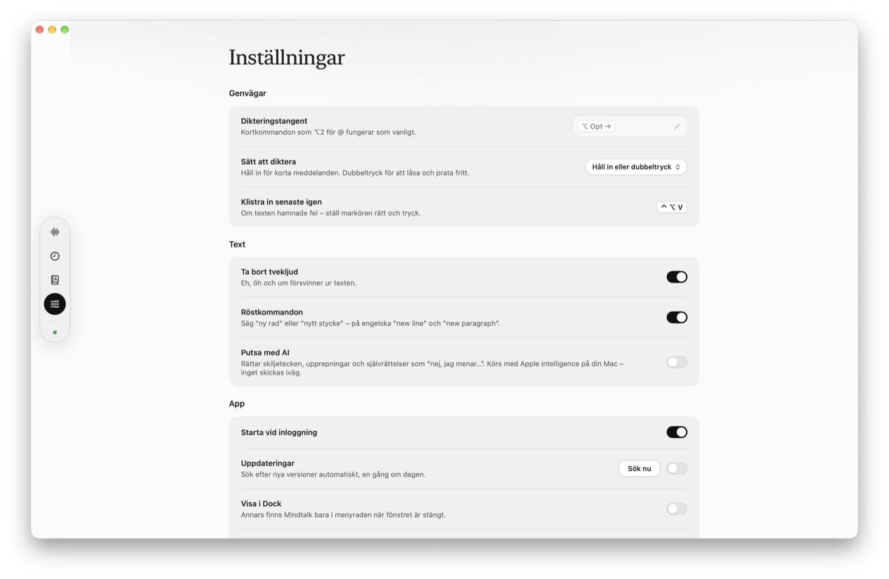</picture></td>
    <td width="50%" align="center"><picture><source media="(prefers-color-scheme: dark)" srcset="docs/images/sv/panel-dark.png">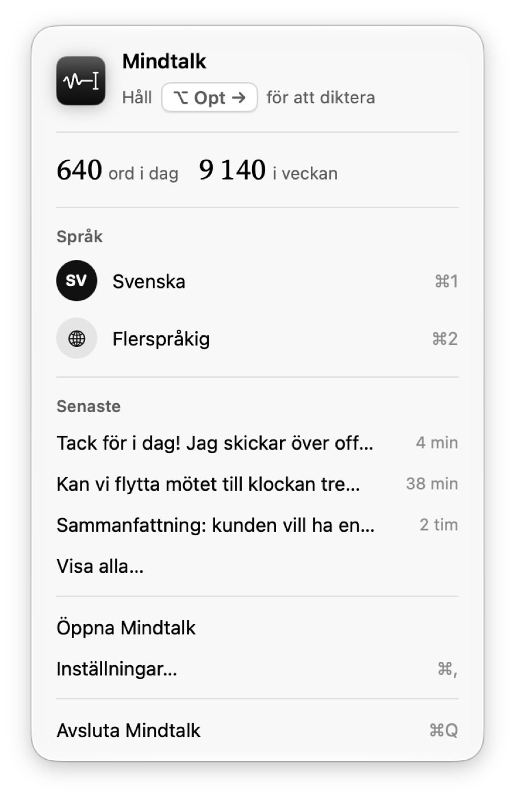</picture></td>
  </tr>
  <tr>
    <td align="center"><sub><b>Inställningar</b></sub></td>
    <td align="center"><sub><b>Menyradspanelen</b></sub></td>
  </tr>
</table>

## Så fungerar det

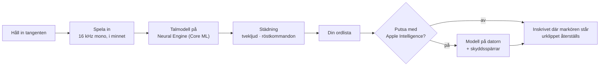

1. En **global tangentlyssnare** (Core Graphics event tap) märker din tangent även när andra appar ligger framme.
2. **Audio Queue** spelar in från mikrofonen du valt via enhetens UID och konverterar ljudet till 16 kHz mono – bara medan du håller in.
3. **[FluidAudio](https://github.com/FluidInference/FluidAudio)** kör talmodellen Parakeet TDT på **Neural Engine** via Core ML.
4. **Regler** tar bort tvekljud och gör *”ny rad”* till radbrytningar – men inte i *”lägg till en ny rad i tabellen”*.
5. Din **ordlista** rättar namn och begrepp.
6. *Valfritt:* **Apples språkmodell på enheten** (Foundation Models) putsar skiljetecken och självrättelser, rad för rad. Svaret används bara om det behåller originalets bokstäver i samma ordning och enbart tar bort några – så den kan aldrig lägga till ord, svara på en fråga i din text eller formulera om dig. Allt annat, eller ett långsamt svar, och den regelstädade texten används.
7. Texten **klistras in** där markören står och urklippet återställs. Inget textfält där (skrivbordet, en webbsida)? Då hamnar den i urklipp i stället, och indikatorn säger det. Eller slå på *Lämna texten i urklipp* för att alltid ha den redo för <kbd>⌘V</kbd>.

## Talmodeller

Ingen av modellerna följer med appen. Du väljer i introduktionen; varje modell laddas ned en gång från en låst version på Hugging Face, varje fil kontrolleras mot sin SHA-256, och sedan fungerar allt offline.

| | Modell | Av | Språk | Storlek |
|---|---|---|---|---|
| **Svenska** | [Klang Pianissimo](https://huggingface.co/KlangAI/pianissimo-sv) | Klang AI AB | Svenska, och hänger med i engelska | 688 MB |
| **Flerspråkig** | [Parakeet Ultra](https://huggingface.co/moondream/parakeet-ultra) | Moondream | 25 europeiska språk | 632 MB |

Båda bygger vidare på [NVIDIA Parakeet TDT 0.6B v3](https://huggingface.co/nvidia/parakeet-tdt-0.6b-v3) och har licensen [CC BY 4.0](https://creativecommons.org/licenses/by/4.0/deed.sv). Core ML-versioner av [markstrom](https://huggingface.co/markstrom/pianissimo-sv-coreml) och [FluidInference](https://huggingface.co/FluidInference/parakeet-ultra-coreml).

## Integritet

- **Inget nätverk**, förutom nedladdningen av en talmodell du bett om och sökningen efter uppdateringar.
- **Ljudet sparas aldrig** – det tolkas från minnet och kastas.
- **Senaste dikteringar** (de 50 senaste) sparas i `~/Library/Application Support/Mindtalk`, läsbara bara för ditt användarkonto, och kan rensas när som helst.
- **Lösenordsfält:** text du dikterar i ett sådant skrivs in men sparas aldrig – varken i Senaste eller i statistiken.
- **Statistiken** räknar ord och sekunder per dag – aldrig själva texten.
- **Hjälpmedel** används för att känna av tangenten och klistra in.
- **AI-putsningen har skyddsspärrar:** svaret används bara om det enbart tar bort tvekljud, upprepningar eller det en självrättelse ersätter – den kan aldrig lägga till ord, ta bort ett ”inte” eller svara på din text.

## Installera

1. [Ladda ned Mindtalk](https://github.com/dragon6sic6/Mindtalk/releases/latest/download/Mindtalk.dmg) – signerad med Developer ID och notariserad av Apple.
2. Öppna DMG-filen och dra **Mindtalk** till **Program**.
3. Öppna Mindtalk. Introduktionen tar dig igenom resten. (Startade du den direkt från DMG-filen eller Hämtade filer? Mindtalk erbjuder sig att flytta till Program.)

Sedan håller Mindtalk sig själv uppdaterad – nyheterna finns under [Releases](https://github.com/dragon6sic6/Mindtalk/releases).

<p align="center">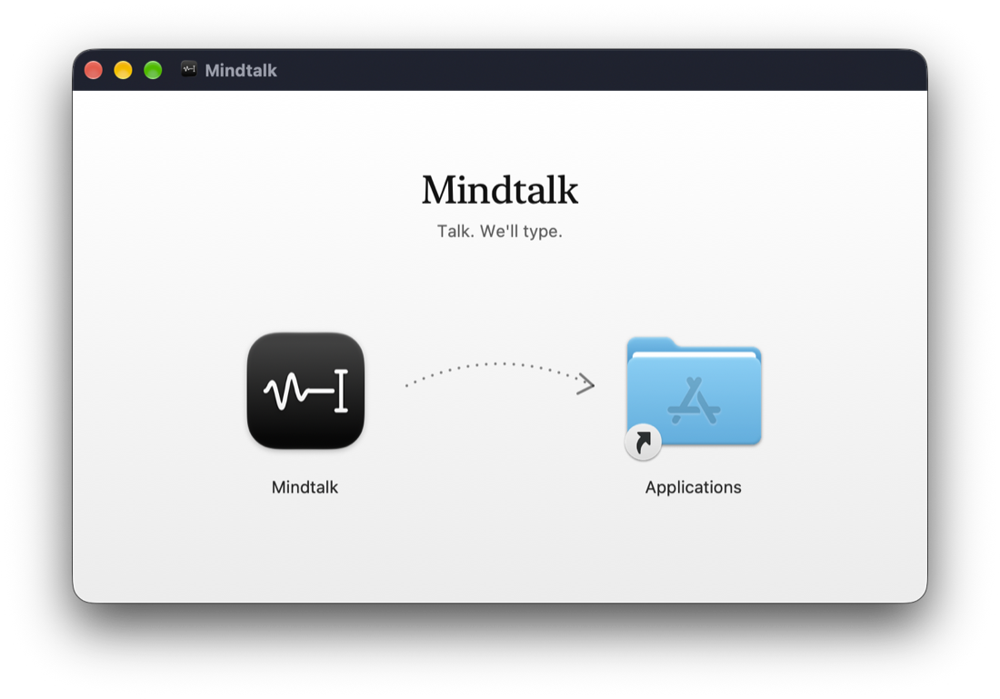</p>

**Krav:** en Mac med Apple Silicon (M1 eller senare), macOS 26 Tahoe eller senare och ungefär 700 MB ledigt per talmodell. *Putsa med AI* kräver att Apple Intelligence är påslaget.

## Tangentbord

| | |
|---|---|
| Håll in tangenten | Prata; släpp för att skriva in |
| Dubbeltryck | Lås handsfree; tryck igen när du är klar |
| <kbd>Mellanslag</kbd> medan du håller in | Lås handsfree |
| <kbd>Esc</kbd> | Avbryt utan att något skrivs |
| <kbd>⌘1</kbd> / <kbd>⌘2</kbd> | Svenska / flerspråkig (i menyradspanelen) |
| <kbd>⌃⌥V</kbd> | Klistra in senaste dikteringen igen |
| <kbd>⌘,</kbd> | Inställningar |

## Bygg själv

```bash
brew install xcodegen
git clone https://github.com/dragon6sic6/Mindtalk.git && cd Mindtalk
make run        # Debug-bygge och start
```

Mer i [docs/DEVELOPMENT.md](docs/DEVELOPMENT.md) (på engelska): självtester och mikrofonkontroller, release-flödet, hur skärmbilderna tas och en karta över koden.

## Byggd med

- **Swift, SwiftUI och AppKit** – en menyradsapp med Liquid Glass på macOS 26
- **[FluidAudio](https://github.com/FluidInference/FluidAudio)** – Parakeet TDT på Neural Engine via Core ML
- **Foundation Models** – Apples språkmodell på enheten, för den valfria putsningen
- **Core Audio** – mikrofonval, enhetsbyten och vilka appar som spelar ljud
- **Audio Queue** – inspelning från vald mikrofon och konvertering till 16 kHz mono
- **Core Graphics event taps** – den globala tangenten
- **ServiceManagement** – starta vid inloggning
- **[Sparkle](https://sparkle-project.org)** – signerade automatiska uppdateringar
- **String Catalogs** – svenskt och engelskt gränssnitt
- **Icon Composer** – appikon i lager med Liquid Glass
- **XcodeGen** och **dmgbuild** – reproducerbart projekt och en snygg DMG

## Tack

Mindtalk görs av [Mindact Solutions AB](https://mindact.ai) i Sverige.

Taligenkänning av **Klang Pianissimo** (Klang AI AB) och **Parakeet Ultra** (Moondream), båda byggda på **NVIDIA Parakeet TDT 0.6B v3** – CC BY 4.0. Körs med **FluidAudio** (FluidInference, Apache 2.0). Alla krediter och länkar finns i appen under *Inställningar → Om Mindtalk*.

## Licens

Mindtalks källkod är släppt under [MIT-licensen](LICENSE). Talmodellerna ingår inte i det här repot och har sina egna licenser (CC BY 4.0).
